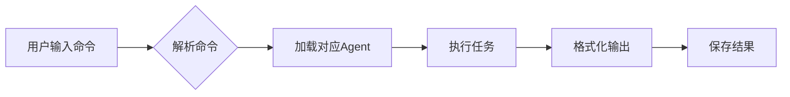

# Agent快捷命令系统

## 🚀 快捷命令列表

### 核心Agent命令
| 命令 | Agent角色 | 说明 | 示例 |
|------|----------|------|------|
| `/pm` | 产品经理 | 需求分析、PRD编写、用户故事 | `/pm 分析电商平台需求` |
| `/ui` `/designer` | UI设计师 | 界面设计、用户体验、设计规范 | `/ui 设计登录页面` |
| `/fe` `/frontend` | 前端工程师 | 前端开发、组件实现、性能优化 | `/fe 实现购物车组件` |
| `/be` `/backend` | 后端工程师 | API开发、数据库设计、系统架构 | `/be 设计用户认证API` |

### 团队协作命令
| 命令 | 功能 | 说明 | 示例 |
|------|------|------|------|
| `/team` | 团队协作 | 启动多Agent协作模式 | `/team 开发待办事项应用` |
| `/review` | 代码评审 | 多角度评审代码 | `/review 检查认证模块` |
| `/standup` | 站会 | 各Agent汇报进度 | `/standup` |
| `/handoff` | 工作交接 | Agent间任务交接 | `/handoff pm->designer` |

### 特定任务命令
| 命令 | 功能 | 说明 | 示例 |
|------|------|------|------|
| `/prd` | PRD文档 | PM生成产品需求文档 | `/prd 社交应用` |
| `/design-system` | 设计系统 | Designer创建设计规范 | `/design-system` |
| `/api-spec` | API规范 | Backend生成API文档 | `/api-spec REST接口` |
| `/component` | 组件开发 | Frontend开发组件 | `/component 数据表格` |

## 📖 命令使用规范

### 基础语法
```bash
/[命令] [任务描述] [--选项]
```

### 命令选项
- `--detail` : 详细模式，输出更多细节
- `--quick` : 快速模式，简洁输出
- `--format [type]` : 指定输出格式（md/json/yaml）
- `--lang [language]` : 指定编程语言或框架

### 使用示例

#### 1. 单Agent任务
```bash
# 产品经理分析需求
/pm 分析在线教育平台的核心功能

# UI设计师设计界面
/ui 设计课程详情页 --detail

# 前端开发组件
/fe 实现视频播放器 --lang react

# 后端设计API
/be 设计课程管理接口 --format openapi
```

#### 2. 协作任务
```bash
# 启动完整团队
/team 开发电商平台 --agents all

# 指定部分Agent协作
/team 设计用户系统 --agents "pm,designer"

# 工作交接
/handoff pm->designer --deliverable "PRD文档"
```

#### 3. 链式命令
```bash
# 完整开发流程
/pm 分析需求 >> /ui 设计界面 >> /fe 实现前端 >> /be 开发后端
```

## 🎯 命令映射规则

### Agent激活映射
```yaml
/pm → 加载 @agents/.claude/prompts/pm.md
/ui, /designer → 加载 @agents/.claude/prompts/designer.md
/fe, /frontend → 加载 @agents/.claude/prompts/frontend.md
/be, /backend → 加载 @agents/.claude/prompts/backend.md
```

### 角色切换规则
- 使用命令自动切换到对应Agent角色
- 保持角色直到下一个命令或明确退出
- 支持角色上下文保持

### 输出格式规范
每个Agent都遵循其prompt中定义的输出规范：
- PM: PRD文档、用户故事
- Designer: 设计规范、组件说明
- Frontend: 代码实现、组件文档
- Backend: API文档、数据库设计

## 🔧 高级用法

### 自定义命令别名
```bash
# 创建别名
/alias /req = /pm --format user-story
/alias /mockup = /ui --quick --format figma
```

### 批量任务
```bash
# 批量生成
/batch {
  /pm 用户管理模块
  /ui 用户列表页面
  /fe 用户组件
  /be 用户CRUD接口
}
```

### 条件执行
```bash
# 条件判断
/if has-prd then /ui else /pm
```

## 💡 最佳实践

### Do's ✅
1. 使用简短清晰的任务描述
2. 按照需求→设计→开发的顺序
3. 利用链式命令完成完整流程
4. 保存重要输出以便后续引用

### Don'ts ❌
1. 避免在一个命令中混合多个任务
2. 不要跳过必要的前置步骤
3. 避免频繁切换Agent角色

## 📊 命令执行流程



## 🆘 故障排除

### 常见问题
1. **命令无响应**: 检查命令拼写和语法
2. **输出不完整**: 添加 `--detail` 选项
3. **角色混乱**: 使用 `/reset` 重置状态

### 调试命令
```bash
/status     # 查看当前Agent状态
/history    # 查看命令历史
/reset      # 重置到初始状态
/help [cmd] # 查看命令帮助
```