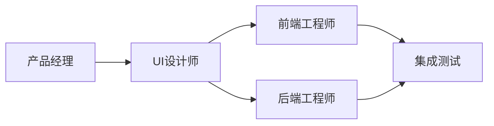

# Agent命令系统

> 通过专业角色Agent协作完成软件开发全流程

## 初始交互

当用户输入 `/agent` 或 `/agents` 时，显示：

```markdown
👥 欢迎使用Agent开发团队！

我可以调动以下专业角色为你服务：

📋 **产品经理** (/pm 或 /agent:pm)
   需求分析 | PRD编写 | 用户故事

🎨 **UI设计师** (/ui 或 /agent:ui)
   界面设计 | 用户体验 | 设计系统

💻 **前端工程师** (/fe 或 /agent:fe)
   Web开发 | 组件实现 | 性能优化

🔧 **后端工程师** (/be 或 /agent:be)
   API开发 | 数据库设计 | 系统架构

🚀 **团队协作** (/team 或 /agent:team)
   多角色协同 | 完整项目开发

你可以：
• 输入具体命令调用单个Agent
• 使用 /team 启动完整项目
• 直接描述你的需求，我会推荐合适的Agent

请问你想要开发什么类型的项目？
```

## 可用命令

### 单Agent命令
| 命令 | 角色 | 描述 |
|------|------|------|
| `/pm` | 产品经理 | 需求分析、PRD编写、用户故事创建 |
| `/ui` `/designer` | UI设计师 | 界面设计、用户体验、设计系统 |
| `/fe` `/frontend` | 前端工程师 | Web开发、组件实现、性能优化 |
| `/be` `/backend` | 后端工程师 | API开发、数据库设计、系统架构 |

### 协作命令
| 命令 | 描述 |
|------|------|
| `/team` | 多Agent团队协作模式 |
| `/team --status` | 查看项目进度 |
| `/team --handoff` | Agent间工作交接 |

## 快速开始

### 1. 产品需求分析
```bash
/pm 分析在线教育平台需求
```

### 2. UI设计
```bash
/ui 设计课程列表界面
```

### 3. 前端开发
```bash
/fe 实现课程卡片组件 --framework react
```

### 4. 后端开发
```bash
/be 设计课程API --lang python --framework fastapi
```

### 5. 团队协作
```bash
/team 开发完整的在线教育平台
```

## 工作流程



## 命令选项

### 通用选项
- `--detail` : 详细输出模式
- `--format [type]` : 输出格式（md/json/yaml）
- `--lang [language]` : 编程语言

### PM选项
- `--format prd|story|brief` : 文档格式
- `--mvp` : MVP规划模式

### UI选项
- `--style modern|minimal|material` : 设计风格
- `--device mobile|desktop|responsive` : 设备类型

### FE选项
- `--framework react|vue|angular` : 前端框架
- `--test` : 包含测试代码

### BE选项
- `--db postgres|mongo|mysql` : 数据库类型
- `--api rest|graphql` : API类型

## Agent职责矩阵

| Agent | 输入 | 输出 | 工具 |
|-------|------|------|------|
| PM | 用户需求 | PRD、用户故事 | Sequential |
| UI | PRD | 设计稿、规范 | Magic、Context7 |
| FE | 设计稿 | 前端代码 | Context7、Magic、Playwright |
| BE | PRD | API、数据库 | Context7、Sequential |

## 最佳实践

### 项目启动流程
1. **需求分析**: `/pm` 明确需求和范围
2. **设计先行**: `/ui` 创建设计规范
3. **并行开发**: `/fe` 和 `/be` 同时进行
4. **集成测试**: `/team` 协调集成

### 质量保证
- 每个Agent都遵循专业规范
- 输出文档完整且规范
- 代码包含测试和文档
- 定期评审和优化

## 相关文件
- Agent定义：`@agents/.claude/prompts/`
- 协作流程：`@agents/workflows/collaboration.md`
- 使用指南：`@agents/README.md`

## 获取帮助
```bash
/agent --help        # 查看帮助
/agent --list        # 列出所有Agent
/agent --version     # 查看版本
```