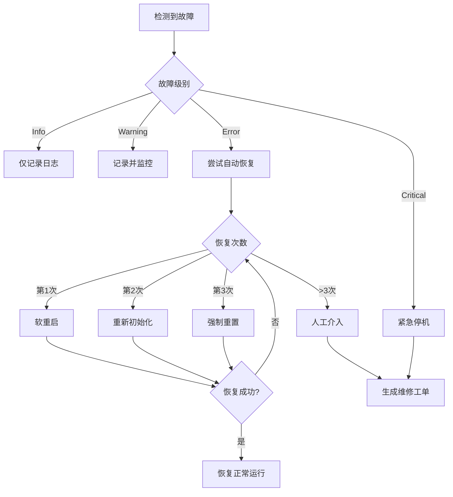

# STM32 硬件故障恢复策略

## 一、概述

本文档定义了推币机游戏系统的故障检测、上报和恢复策略，确保系统在各种故障情况下能够快速恢复正常运行。

## 二、故障分级

### 1. 故障严重级别

| 级别 | 代码 | 说明 | 响应时间 | 处理策略 |
|------|------|------|----------|----------|
| **提示 (Info)** | 0x01 | 一般性信息，不影响运行 | 记录即可 | 仅记录日志 |
| **警告 (Warning)** | 0x02 | 潜在问题，需要关注 | 30分钟内 | 记录并通知维护人员 |
| **错误 (Error)** | 0x03 | 影响部分功能 | 10分钟内 | 尝试自动恢复，通知管理员 |
| **严重 (Critical)** | 0x04 | 系统无法正常运行 | 立即 | 立即停机保护，紧急通知 |

## 三、故障类型及恢复策略

### 1. 上币电机故障 (0x01)

**故障现象**：
- 电机无响应
- 电机异响
- 出币速度异常

**恢复策略**：
```
1. 首次检测：记录故障时间和状态
2. 第一次恢复尝试：
   - 停止电机 500ms
   - 重新启动电机
   - 测试出币功能
3. 第二次恢复尝试：
   - 执行电机复位命令 (RecoveryRestart)
   - 等待 2 秒
   - 重新初始化电机参数
4. 第三次恢复尝试：
   - 强制重置硬件 (RecoveryForceReset)
   - 重新校准电机位置
5. 最终处理：
   - 标记电机故障
   - 禁用出币功能
   - 通知维护人员更换电机
```

### 2. 退币电机故障 (0x02)

**故障现象**：
- 无法退币
- 退币卡币
- 退币数量错误

**恢复策略**：
```
1. 立即响应：
   - 停止当前退币操作
   - 记录用户应退币数
2. 自动恢复：
   - 反转电机 100ms（清除卡币）
   - 重试退币操作（最多3次）
3. 备用方案：
   - 切换到其他退币通道（如有）
   - 记录欠币信息到数据库
4. 人工介入：
   - 生成退币凭证
   - 通知工作人员手动退币
```

### 3. 彩票机故障 (0x03/0x04)

#### 3.1 缺纸故障 (0x03)

**恢复策略**：
```
1. 预警阶段（余量<50）：
   - 发送补纸提醒
   - 继续正常打印
2. 警告阶段（余量<10）：
   - 限制大额彩票打印
   - 紧急通知补纸
3. 停机阶段（余量=0）：
   - 停止彩票功能
   - 切换到积分模式
   - 等待补纸完成
```

#### 3.2 卡纸故障 (0x04)

**恢复策略**：
```
1. 自动清理：
   - 反向走纸 50mm
   - 正向走纸重试
   - 最多尝试3次
2. 手动清理：
   - 提示打开机门
   - 指导清理步骤
   - 重新校准打印头
```

### 4. 推币电机过载 (0x05)

**故障现象**：
- 电流过大
- 电机过热
- 推币卡死

**恢复策略**：
```
1. 立即保护：
   - 立即停止推币电机
   - 记录过载参数
2. 冷却等待：
   - 等待 30 秒冷却
   - 监测温度传感器
3. 渐进恢复：
   - 以 50% 速度启动
   - 逐步提升到正常速度
   - 监测电流变化
4. 降级运行：
   - 限制最大推币速度为 70%
   - 增加推币间隔时间
   - 持续监测温度
```

### 5. 投币器卡币 (0x06)

**恢复策略**：
```
1. 检测确认：
   - 连续3次投币无响应
   - 或投币传感器异常
2. 自动清理：
   - 激活防卡币机制
   - 震动投币通道
   - 反向退币尝试
3. 用户引导：
   - 显示"请轻拍投币口"
   - 提供退币选项
4. 记录补偿：
   - 记录卡币时间和金额
   - 生成补偿凭证
```

### 6. 温度过高 (0x07)

**分级处理**：
```
温度 < 45°C：正常运行
45°C - 50°C：警告级别
  - 降低推币频率
  - 增强散热风扇
50°C - 55°C：限制级别
  - 推币速度降至 50%
  - 限制游戏时长
  - 间歇性停机散热
> 55°C：紧急停机
  - 立即停止所有电机
  - 仅保留基本功能
  - 等待降温至 40°C 以下
```

### 7. 传感器异常 (0x08)

**恢复策略**：
```
1. 传感器校准：
   - 读取传感器基准值
   - 对比历史数据
   - 自动校准偏差
2. 冗余切换：
   - 启用备用传感器（如有）
   - 使用软件模拟值
3. 降级模式：
   - 禁用依赖该传感器的功能
   - 切换到手动模式
```

## 四、恢复动作定义

### 恢复动作代码

| 动作 | 代码 | 说明 | 适用场景 |
|------|------|------|----------|
| **重启设备** | 0x01 | 软重启相关模块 | 一般性故障 |
| **清除标志** | 0x02 | 清除故障标志位 | 临时性故障已解决 |
| **强制重置** | 0x03 | 硬件强制复位 | 严重故障 |
| **重试操作** | 0x04 | 重新执行失败的操作 | 偶发性故障 |
| **跳过故障** | 0x05 | 忽略并继续 | 非关键性故障 |

## 五、自动恢复流程



## 六、故障统计与分析

### 1. 故障记录

每次故障都应记录以下信息：
- 故障时间戳
- 故障代码和级别
- 设备状态快照
- 恢复尝试次数
- 恢复是否成功
- 影响的用户数

### 2. 统计指标

```json
{
  "daily_stats": {
    "total_faults": 0,
    "auto_recovered": 0,
    "manual_intervention": 0,
    "average_recovery_time": 0,
    "most_common_fault": null
  },
  "fault_distribution": {
    "0x01": 0,  // 上币电机
    "0x02": 0,  // 退币电机
    "0x03": 0,  // 缺纸
    "0x04": 0,  // 卡纸
    "0x05": 0,  // 过载
    "0x06": 0,  // 卡币
    "0x07": 0,  // 过热
    "0x08": 0   // 传感器
  }
}
```

### 3. 预防性维护

基于故障统计数据，系统应：
- 预测潜在故障
- 提前安排维护
- 优化恢复策略
- 更新故障阈值

## 七、实施代码示例

```go
// 故障恢复管理器
type FaultRecoveryManager struct {
    controller   *STM32Controller
    recoveryMap  map[byte]RecoveryStrategy
    attemptCount map[byte]int
    logger       *zap.Logger
}

// 恢复策略
type RecoveryStrategy struct {
    MaxAttempts   int
    Actions       []RecoveryAction
    CooldownTime  time.Duration
    EscalateLevel byte
}

// 执行恢复
func (m *FaultRecoveryManager) HandleFault(fault *FaultEvent) error {
    strategy := m.recoveryMap[fault.FaultCode]
    attempts := m.attemptCount[fault.FaultCode]
    
    if attempts >= strategy.MaxAttempts {
        return m.escalateFault(fault)
    }
    
    for _, action := range strategy.Actions {
        if err := m.executeAction(action, fault); err != nil {
            m.logger.Error("Recovery action failed", 
                zap.Error(err),
                zap.Uint8("fault", fault.FaultCode))
            continue
        }
        
        // 验证恢复是否成功
        if m.verifyRecovery(fault) {
            m.attemptCount[fault.FaultCode] = 0
            return nil
        }
    }
    
    m.attemptCount[fault.FaultCode]++
    time.Sleep(strategy.CooldownTime)
    return fmt.Errorf("recovery failed after %d attempts", attempts+1)
}
```

## 八、应急响应流程

### 1. 一级响应（自动处理）
- 触发条件：Info 和 Warning 级别故障
- 响应时间：<1分钟
- 处理方式：系统自动记录和恢复

### 2. 二级响应（远程处理）
- 触发条件：Error 级别故障
- 响应时间：<10分钟
- 处理方式：远程诊断和恢复

### 3. 三级响应（现场处理）
- 触发条件：Critical 级别故障
- 响应时间：<30分钟
- 处理方式：技术人员现场维修

## 九、维护建议

### 日常维护
1. 每日检查故障日志
2. 每周清理投币通道
3. 每月检查电机状态
4. 每季度更换易损件

### 预防措施
1. 定期固件升级
2. 传感器定期校准
3. 温度监控告警
4. 备件库存管理

## 十、总结

本故障恢复策略通过分级处理、自动恢复、统计分析等手段，确保推币机系统的高可用性。关键原则：

1. **快速响应**：分级处理，优先恢复核心功能
2. **智能恢复**：自动尝试多种恢复策略
3. **数据驱动**：基于统计分析优化策略
4. **用户优先**：最小化对用户体验的影响
5. **持续改进**：不断优化恢复流程和预防措施