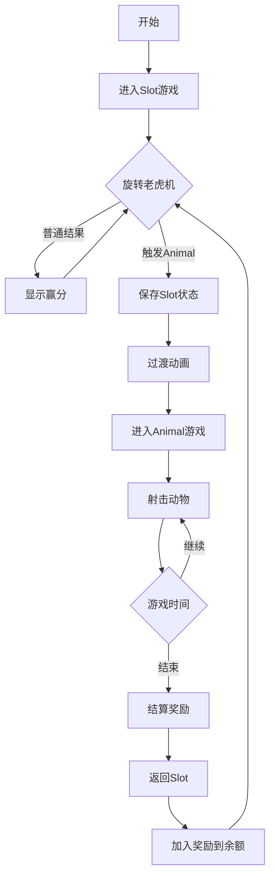

# 🎮 Slot→Animal 游戏桥接架构设计

## 📋 需求分析

你的设计思路很好！让每个游戏模块独立，通过前端控制切换，这种架构有以下优势：
- ✅ **解耦合**：游戏逻辑完全独立
- ✅ **可扩展**：轻松添加新游戏模式
- ✅ **易维护**：单一职责，问题定位简单
- ✅ **灵活切换**：前端控制流程，体验流畅

---

## 🏗️ 推荐架构方案

### 方案一：前端控制切换（推荐）⭐⭐⭐⭐⭐

```
┌──────────────────────────────────────────────┐
│                 前端客户端                     │
│  ┌─────────┐  触发条件  ┌─────────┐          │
│  │  Slot   │ ─────────> │ Animal  │          │
│  │  场景   │            │  场景   │          │
│  └─────────┘            └─────────┘          │
│       ↓                      ↓               │
│   使用slot.proto         使用animal.proto     │
└───────┬──────────────────────┬───────────────┘
        │                      │
        ↓                      ↓
┌───────────────┐      ┌───────────────┐
│  Slot服务模块  │      │ Animal服务模块 │
│  独立的游戏逻辑 │      │  独立的游戏逻辑 │
└───────────────┘      └───────────────┘
```

#### 实现方式

```javascript
// 前端游戏管理器
class GameManager {
    constructor() {
        this.currentGame = 'slot';
        this.slotGame = new SlotGame();
        this.animalGame = new AnimalGame();
        this.ws = null;
    }
    
    // Slot游戏结果处理
    handleSlotResult(result) {
        // 显示老虎机结果
        this.slotGame.showResult(result);
        
        // 检查是否触发Animal游戏
        if (this.checkAnimalTrigger(result)) {
            // 记录触发数据
            const triggerData = {
                fromSlot: true,
                bonusType: result.triggerType,
                betAmount: result.betAmount,
                freeSpins: result.bonusSpins || 10
            };
            
            // 切换到Animal游戏
            this.switchToAnimal(triggerData);
        }
    }
    
    // 检查触发条件
    checkAnimalTrigger(result) {
        // 检查特殊图案组合
        const triggerPatterns = [
            ['animal', 'animal', 'animal', 'animal', 'animal'], // 5个动物图案
            ['bonus', 'bonus', 'bonus'],                        // 3个bonus图案
            // 其他触发条件...
        ];
        
        return triggerPatterns.some(pattern => 
            this.matchPattern(result.grid, pattern)
        );
    }
    
    // 切换到Animal游戏
    switchToAnimal(triggerData) {
        // 1. 保存Slot游戏状态
        this.slotGame.saveState();
        
        // 2. 显示过渡动画
        this.showTransition('slot-to-animal');
        
        // 3. 初始化Animal游戏
        this.currentGame = 'animal';
        this.animalGame.init(triggerData);
        
        // 4. 发送进入Animal房间请求
        this.sendMessage(1801, { // m_1801_tos
            type: 6  // 单人场
        });
    }
    
    // Animal游戏结束，返回Slot
    onAnimalGameEnd(result) {
        // 1. 结算奖励
        const totalWin = result.total_win;
        
        // 2. 显示过渡动画
        this.showTransition('animal-to-slot');
        
        // 3. 恢复Slot游戏
        this.currentGame = 'slot';
        this.slotGame.restore();
        this.slotGame.addBonus(totalWin);
        
        // 4. 重新进入Slot房间
        this.sendMessage(1901, { // m_1901_tos
            type: 1  // 麻将主题
        });
    }
}
```

### 方案二：服务端状态机（备选）⭐⭐⭐

```
┌────────────────────────────────────────┐
│            游戏状态机                    │
│  ┌──────┐ trigger ┌──────┐ complete   │
│  │ Slot │ ──────> │Animal│ ────────>   │
│  │ Mode │         │ Mode │             │
│  └──────┘ <────── └──────┘             │
│           return                       │
└────────────────────────────────────────┘
```

虽然可以在服务端管理状态，但会增加复杂度。

---

## 🎯 详细实现方案

### 1. 后端模块独立设计

```go
// internal/game/game_manager.go
package game

type GameType string

const (
    GameTypeSlot   GameType = "slot"
    GameTypeAnimal GameType = "animal"
)

// 游戏管理器（每个连接一个实例）
type GameManager struct {
    slotEngine   *SlotGameEngine
    animalEngine *AnimalGameEngine
    currentGame  GameType
    session      *PlayerSession
}

// 玩家会话（跨游戏共享）
type PlayerSession struct {
    PlayerID    uint32
    Balance     uint64
    TotalWin    uint64
    
    // Slot状态
    SlotState   *SlotState
    
    // Animal状态
    AnimalState *AnimalState
    
    // 桥接数据
    BridgeData  *BridgeData
}

// 桥接数据（游戏间传递）
type BridgeData struct {
    FromGame    GameType
    ToGame      GameType
    TriggerType string
    BonusAmount uint64
    FreeRounds  uint32
    Multiplier  float64
}
```

### 2. Slot游戏触发逻辑

```go
// internal/game/slot_trigger.go
package game

// Slot游戏结果扩展
type SlotResultExt struct {
    *SpinResult
    TriggerBonus bool        // 是否触发bonus
    BonusType    string      // bonus类型
    BonusData    interface{} // bonus数据
}

// 检查特殊触发
func (e *SlotGameEngine) CheckSpecialTrigger(grid [][]Symbol) *BonusTrigger {
    // 定义触发图案
    triggers := []TriggerPattern{
        {
            Name:     "animal_bonus",
            Symbols:  []Symbol{ANIMAL_WILD, ANIMAL_WILD, ANIMAL_WILD},
            MinCount: 3,
            Type:     "enter_animal",
        },
        {
            Name:     "super_bonus", 
            Symbols:  []Symbol{BONUS, BONUS, BONUS, BONUS, BONUS},
            MinCount: 5,
            Type:     "enter_animal_super",
        },
    }
    
    for _, trigger := range triggers {
        if count := e.countSymbols(grid, trigger.Symbols); count >= trigger.MinCount {
            return &BonusTrigger{
                Type:      trigger.Type,
                Name:      trigger.Name,
                FreeSpins: uint32(count * 5), // 每个符号5次
                Multiplier: float64(count),
            }
        }
    }
    
    return nil
}

// 处理Spin结果
func (e *SlotGameEngine) ProcessSpin(betAmount uint32, session *PlayerSession) *SlotResultExt {
    // 基础游戏逻辑
    baseResult := e.Spin(betAmount, session)
    
    // 检查是否触发Animal游戏
    trigger := e.CheckSpecialTrigger(baseResult.Grid)
    
    result := &SlotResultExt{
        SpinResult: baseResult,
    }
    
    if trigger != nil {
        result.TriggerBonus = true
        result.BonusType = trigger.Type
        result.BonusData = trigger
        
        // 保存桥接数据
        session.BridgeData = &BridgeData{
            FromGame:    GameTypeSlot,
            ToGame:      GameTypeAnimal,
            TriggerType: trigger.Type,
            FreeRounds:  trigger.FreeSpins,
            Multiplier:  trigger.Multiplier,
        }
    }
    
    return result
}
```

### 3. 协议扩展设计

```protobuf
// proto/bridge.proto
syntax = "proto2";

package bridge;

// 游戏切换通知
// @name game_switch
message m_9901_toc {
    required    e_switch_type   type        = 1; // 切换类型
    required    string          from_game   = 2; // 源游戏
    required    string          to_game     = 3; // 目标游戏
    optional    p_bridge_data   data        = 4; // 桥接数据
}

message p_bridge_data {
    optional    uint32      free_rounds = 1; // 免费次数
    optional    float       multiplier  = 2; // 倍率
    optional    uint64      bonus_pool  = 3; // 奖池
    optional    string      trigger_type = 4; // 触发类型
}

enum e_switch_type {
    switch_immediate = 1;  // 立即切换
    switch_after_round = 2; // 回合结束后切换
    switch_optional = 3;   // 可选切换（玩家选择）
}

// Slot游戏结果扩展
message m_1902_toc_ext {
    // ... 原有字段 ...
    
    // 新增触发字段
    optional    bool        trigger_bonus = 10; // 是否触发bonus
    optional    string      bonus_type    = 11; // bonus类型
    optional    p_bridge_data bridge_data = 12; // 桥接数据
}
```

### 4. 前端游戏切换器

```javascript
// static/js/game_switcher.js
class GameSwitcher {
    constructor() {
        this.games = {
            slot: null,
            animal: null
        };
        this.currentGame = null;
        this.transitionData = null;
    }
    
    // 初始化游戏模块
    init() {
        this.games.slot = new SlotGameModule({
            onTriggerBonus: (data) => this.handleBonusTrigger(data)
        });
        
        this.games.animal = new AnimalGameModule({
            onGameEnd: (result) => this.handleAnimalEnd(result)
        });
        
        // 默认启动Slot
        this.switchGame('slot');
    }
    
    // 处理Bonus触发
    handleBonusTrigger(data) {
        console.log('触发Bonus游戏:', data);
        
        // 保存触发数据
        this.transitionData = {
            fromGame: 'slot',
            toGame: 'animal',
            triggerType: data.bonus_type,
            freeRounds: data.free_rounds || 10,
            multiplier: data.multiplier || 1.0,
            returnTo: 'slot'
        };
        
        // 显示切换动画
        this.showTransitionAnimation('slot-to-animal', () => {
            // 切换到Animal游戏
            this.switchGame('animal', this.transitionData);
        });
    }
    
    // 切换游戏
    switchGame(gameName, initData = null) {
        // 1. 停止当前游戏
        if (this.currentGame) {
            this.currentGame.pause();
        }
        
        // 2. 切换到新游戏
        this.currentGame = this.games[gameName];
        
        // 3. 初始化新游戏
        if (initData) {
            this.currentGame.initWithData(initData);
        } else {
            this.currentGame.init();
        }
        
        // 4. 更新UI
        this.updateGameUI(gameName);
        
        // 5. 开始新游戏
        this.currentGame.start();
    }
    
    // Animal游戏结束处理
    handleAnimalEnd(result) {
        const winAmount = result.total_win;
        
        // 应用倍率
        const finalWin = winAmount * (this.transitionData?.multiplier || 1);
        
        // 显示结算画面
        this.showBonusResult(finalWin, () => {
            // 返回Slot游戏
            this.showTransitionAnimation('animal-to-slot', () => {
                this.switchGame('slot', {
                    bonusWin: finalWin
                });
            });
        });
    }
    
    // 过渡动画
    showTransitionAnimation(type, callback) {
        const transitions = {
            'slot-to-animal': {
                duration: 2000,
                effect: 'zoom-in',
                sound: 'bonus_trigger.mp3',
                text: '进入疯狂动物园！'
            },
            'animal-to-slot': {
                duration: 1500,
                effect: 'fade',
                sound: 'bonus_complete.mp3',
                text: '返回老虎机'
            }
        };
        
        const config = transitions[type];
        
        // 播放动画
        this.playTransition(config, callback);
    }
}
```

### 5. 消息路由设计

```go
// internal/protocol/router.go
package protocol

type MessageRouter struct {
    slotHandler   *SlotHandler
    animalHandler *AnimalHandler
    configHandler *ConfigHandler
}

func (r *MessageRouter) Route(msgID uint16, data []byte, session *PlayerSession) error {
    // 根据消息ID范围路由到不同处理器
    switch {
    case msgID >= 1900 && msgID < 2000:
        // Slot游戏消息
        return r.slotHandler.Handle(msgID, data, session)
        
    case msgID >= 1800 && msgID < 1900:
        // Animal游戏消息
        return r.animalHandler.Handle(msgID, data, session)
        
    case msgID >= 2000 && msgID < 2100:
        // 配置消息
        return r.configHandler.Handle(msgID, data, session)
        
    case msgID >= 9900 && msgID < 10000:
        // 桥接消息（如果需要）
        return r.handleBridge(msgID, data, session)
        
    default:
        return ErrUnknownMessage
    }
}
```

---

## 🎮 游戏流程示例

### 完整游戏流程



### 数据流转

```yaml
# 1. Slot游戏中
SlotState:
  balance: 10000
  current_bet: 10
  total_win: 500

# 2. 触发Animal
TriggerData:
  type: "animal_bonus"
  free_rounds: 15
  multiplier: 2.0

# 3. Animal游戏中
AnimalState:
  bullets: 15  # 免费子弹数
  animals_hit: 8
  current_win: 300

# 4. 返回Slot
ReturnData:
  animal_win: 300
  final_win: 600  # 300 * 2.0倍率
  new_balance: 10600
```

---

## 🚀 实现建议

### 推荐方案优势
1. **前端控制切换**
   - ✅ 逻辑清晰，易于理解
   - ✅ 游戏模块完全独立
   - ✅ 添加新游戏简单
   - ✅ 前端体验流畅

2. **独立游戏服务**
   - ✅ 各游戏独立开发测试
   - ✅ 互不影响，稳定性高
   - ✅ 可独立部署扩容

### 实现步骤
1. **第一步**：完成Slot独立模块
2. **第二步**：完成Animal独立模块
3. **第三步**：实现前端切换逻辑
4. **第四步**：添加过渡动画和音效
5. **第五步**：测试完整流程

### 注意事项
- 💡 游戏间数据传递要明确定义
- 💡 状态保存和恢复要完善
- 💡 过渡动画提升用户体验
- 💡 错误处理确保不会卡死

---

## 📝 接口约定

### Slot → Animal 触发条件
```javascript
// 触发条件配置
const TRIGGER_CONDITIONS = {
    // 3个动物Wild触发普通Animal游戏
    animal_bonus: {
        symbols: ['animal_wild', 'animal_wild', 'animal_wild'],
        min_count: 3,
        free_rounds: count => count * 5,
        multiplier: 1.0
    },
    
    // 5个Bonus符号触发超级Animal游戏
    super_animal: {
        symbols: ['bonus', 'bonus', 'bonus', 'bonus', 'bonus'],
        min_count: 5,
        free_rounds: 30,
        multiplier: 3.0
    },
    
    // 特定图案组合
    special_pattern: {
        pattern: [
            [null, 'animal', null],
            ['animal', 'wild', 'animal'],
            [null, 'animal', null]
        ],
        free_rounds: 20,
        multiplier: 2.0
    }
};
```

### Animal → Slot 返回数据
```javascript
// Animal游戏结束返回数据
const ANIMAL_RESULT = {
    total_win: 5000,      // Animal游戏赢分
    animals_killed: 25,    // 击杀动物数
    bonus_triggered: 2,    // 触发的额外bonus
    achievements: [        // 成就
        'sharpshooter',   // 神枪手
        'combo_master'    // 连击大师
    ]
};
```

---

## 🎯 总结

**推荐采用方案一：前端控制切换**

这种设计让每个游戏完全独立，通过前端控制游戏切换，具有最大的灵活性和可维护性。后端只需要专注于各自游戏逻辑，不需要处理复杂的状态转换。

关键点：
1. 每个游戏使用独立的proto和处理逻辑
2. 前端负责检测触发条件和切换控制
3. 通过明确的数据结构传递游戏间信息
4. 良好的过渡动画提升用户体验

这样的架构可以轻松扩展更多游戏模式，比如将来可能的 Slot→Fishing、Animal→Bonus 等组合。