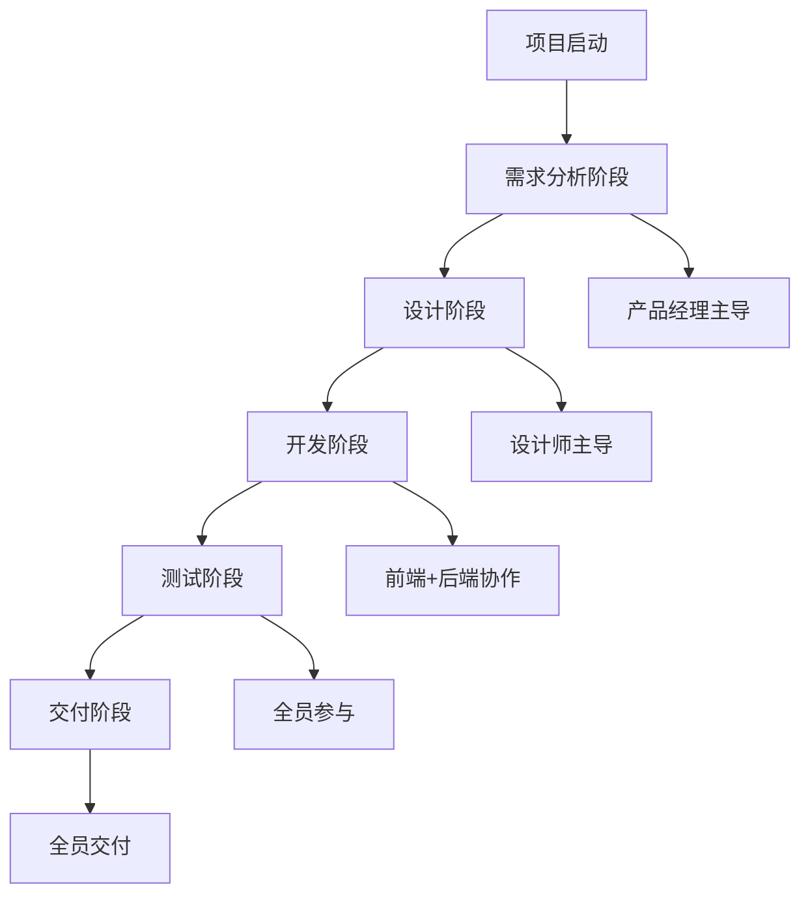

# Multi-Agent协作工作流

## 工作流程概览



## 详细协作流程

### 阶段1：需求分析（PM主导）

#### 1.1 需求收集
```yaml
负责人: 产品经理
参与者: 全体Agent
输入: 用户需求、业务目标
输出: 
  - 需求列表
  - 用户画像
  - 竞品分析

工作内容:
  PM:
    - 收集和整理需求
    - 编写用户故事
    - 确定产品范围
  Designer:
    - 提供用户体验建议
    - 参与需求评审
  Frontend:
    - 评估前端可行性
    - 提供技术建议
  Backend:
    - 评估后端可行性
    - 确认技术架构
```

#### 1.2 需求评审
```yaml
评审会议:
  主持: PM
  参与: 全体Agent
  议程:
    1. PRD文档评审
    2. 功能优先级确认
    3. 技术可行性讨论
    4. 时间计划制定
  
输出物:
  - 确认的PRD文档
  - 功能优先级列表
  - 项目时间线
```

### 阶段2：设计阶段（Designer主导）

#### 2.1 概念设计
```yaml
负责人: UI设计师
参与者: PM、前端工程师
输入: PRD文档、用户故事
输出:
  - 信息架构图
  - 用户流程图
  - 低保真原型

协作要点:
  Designer → PM:
    - 确认设计理解是否正确
    - 获取设计反馈
  Designer → Frontend:
    - 讨论交互可行性
    - 确认技术限制
```

#### 2.2 视觉设计
```yaml
负责人: UI设计师
参与者: PM、前端工程师
输入: 低保真原型、品牌规范
输出:
  - 高保真设计稿
  - 设计规范文档
  - 组件库

协作要点:
  Designer → Frontend:
    - 提供设计标注
    - 说明动效细节
  Designer → Backend:
    - 确认数据展示需求
    - 讨论性能影响
```

### 阶段3：开发阶段（工程师协作）

#### 3.1 技术设计
```yaml
并行任务:
  Backend:
    - 数据库设计
    - API接口设计
    - 系统架构设计
  Frontend:
    - 前端架构设计
    - 组件规划
    - 路由设计

协作点:
  - API接口对接会议
  - 数据格式确认
  - 认证方案讨论
```

#### 3.2 开发实施
```yaml
开发模式: 并行开发 + 持续集成

Backend任务:
  Week 1:
    - 搭建项目框架
    - 数据库初始化
    - 基础中间件
  Week 2:
    - 核心API开发
    - 业务逻辑实现
  Week 3:
    - 接口联调
    - 性能优化

Frontend任务:
  Week 1:
    - 搭建项目框架
    - 基础组件开发
    - 路由配置
  Week 2:
    - 页面开发
    - 状态管理
  Week 3:
    - 接口对接
    - 交互优化

每日同步:
  - 站会时间: 每天10:00
  - 同步内容: 进度、问题、计划
```

### 阶段4：测试阶段（全员参与）

#### 4.1 测试准备
```yaml
测试计划:
  单元测试:
    - Frontend: 组件测试
    - Backend: 接口测试
  集成测试:
    - API联调测试
    - 端到端测试
  验收测试:
    - 功能验收
    - 设计还原度验收
```

#### 4.2 问题修复
```yaml
Bug处理流程:
  1. 问题发现 → 创建Issue
  2. 分配负责人
  3. 问题修复
  4. 回归测试
  5. 关闭Issue

优先级:
  P0: 阻塞性问题，立即修复
  P1: 重要问题，当天修复
  P2: 一般问题，迭代修复
```

### 阶段5：交付阶段（全员协作）

#### 5.1 交付准备
```yaml
交付清单:
  PM:
    - 产品说明文档
    - 用户手册
  Designer:
    - 设计源文件
    - 设计规范
  Frontend:
    - 前端代码
    - 部署文档
  Backend:
    - 后端代码
    - API文档
    - 数据库脚本
```

#### 5.2 部署上线
```yaml
部署流程:
  1. 代码审查
  2. 测试环境部署
  3. 预发布环境验证
  4. 生产环境部署
  5. 线上验证
  
回滚方案:
  - 快速回滚机制
  - 数据备份策略
  - 应急响应流程
```

## 协作工具和规范

### 沟通工具
```yaml
即时通讯: Slack/企业微信
项目管理: Jira/Trello
文档协作: Notion/语雀
代码管理: GitHub/GitLab
设计协作: Figma
```

### 文档规范
```yaml
文档命名:
  - PRD: PRD_[项目名]_[版本].md
  - 设计: Design_[模块]_[版本].fig
  - API: API_[服务名]_[版本].yaml

版本管理:
  - 主版本: 重大更新
  - 次版本: 功能更新
  - 补丁版本: Bug修复
```

### 会议规范
```yaml
每日站会:
  时间: 10:00-10:15
  内容: 昨天完成、今天计划、遇到问题

周会:
  时间: 周一 14:00-15:00
  内容: 本周计划、风险同步

评审会:
  需求评审: 需求确定后
  设计评审: 设计完成后
  代码评审: 功能完成后
```

## 冲突解决机制

### 技术分歧
```yaml
解决流程:
  1. 各方陈述方案和理由
  2. 技术负责人评估
  3. 团队投票决策
  4. 记录决策原因
```

### 需求变更
```yaml
变更流程:
  1. PM评估变更影响
  2. 团队评估工作量
  3. 确定变更优先级
  4. 更新项目计划
```

### 进度延期
```yaml
应对措施:
  1. 分析延期原因
  2. 评估影响范围
  3. 制定补救方案
  4. 调整项目计划
```

## 质量保证

### 代码质量
- 代码审查制度
- 自动化测试覆盖率 >80%
- 代码规范检查

### 设计质量
- 设计还原度 >95%
- 用户体验测试
- 可访问性检查

### 产品质量
- 功能完整性验证
- 性能指标达标
- 安全漏洞扫描

## Agent调用示例

### 启动项目
```bash
# 初始化项目
/team init --project "电商平台" --agents "pm,designer,frontend,backend"

# PM开始需求分析
/agent pm --task "analyze" --input "用户需要一个在线购物平台"

# Designer开始设计
/agent designer --task "design" --input "基于PRD设计购物车页面"

# 前后端并行开发
/agent frontend --task "develop" --input "实现购物车组件"
/agent backend --task "develop" --input "开发购物车API"

# 团队协作模式
/team collaborate --stage "development" --sync
```

### 任务分配
```bash
# 分配具体任务
/task assign --agent pm --task "编写用户故事"
/task assign --agent designer --task "设计登录页面"
/task assign --agent frontend --task "实现用户认证"
/task assign --agent backend --task "开发认证API"

# 查看任务状态
/task status --project "电商平台"

# 任务交接
/task handoff --from pm --to designer --deliverable "PRD文档"
```

### 进度同步
```bash
# 每日站会
/standup --team all --report

# 进度查询
/progress --project "电商平台" --detail

# 风险上报
/risk report --level high --issue "API延期" --impact "前端开发受阻"
```